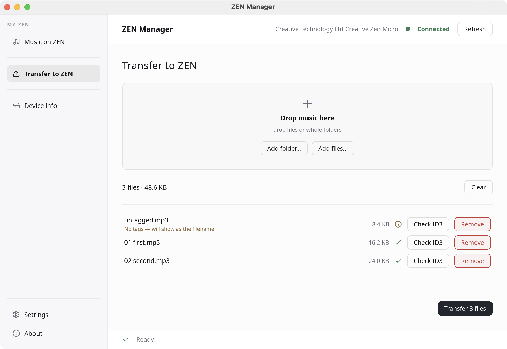
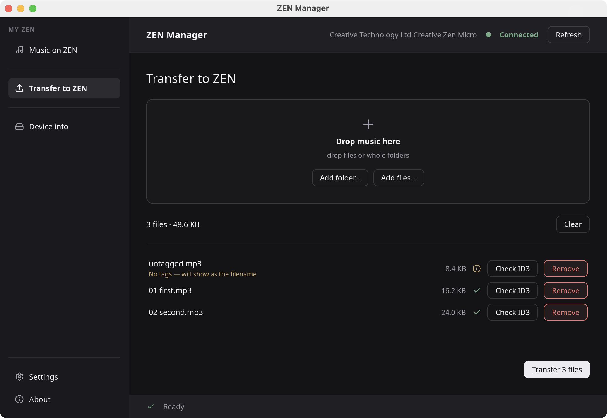

# ZEN Manager

Modern software for two decade old hardware.

A desktop app for getting music onto a Creative Zen Micro, built because not
everyone fancies Microslop Windows in 2026.

No internet. No accounts. No telemetry. Plug in the player, drop in some music,
done.

| Light | Dark |
|---|---|
|  |  |

## What it does

- **Drag and drop** files or whole folders straight from your file manager
- **Reads your tags** and writes them to the device, so tracks show up under the
  right artist and album on the player instead of as filenames
- **Tells you what will fail before you transfer** — unsupported formats,
  duplicates already on the device, files that won't fit, files with no tags
- **Browse the device** as an artist → album → track tree, select whole artists
  or albums, delete in one go
- **Inspect ID3 tags** of anything queued, before sending it
- **Device info** — model, battery, and storage broken down
- Light, dark, or follow the system
- Translatable, with translations bundled into the binary

## Why the tags matter

The Zen builds its Music, Artists and Albums menus from **MTP object
properties**, not from the ID3 tags inside your files. A plain file copy — which
is what generic MTP tools do — lands the file on the device where the player
can never find it.

This app sets those properties from your tags after each transfer. If a track
has no album tag it gets filed under `unknown` rather than left blank, because a
track with no album is unreachable in the player's menus.

## ZEN Manager is not a tag editor

It never will be. Tagging is a job for programs built for it — MusicBrainz
Picard, Mp3tag, Kid3 and the like. ZEN Manager reads your tags, writes them to
the device as MTP properties, and otherwise leaves your files alone. It never
modifies them.

Which tag version you use does not matter. Whatever your tagger writes is read
(ID3v1, ID3v2.2, ID3v2.3, ID3v2.4, APEv1/APEv2, Vorbis comments, MP4 ilst, RIFF
INFO, AIFF text chunks).

Tag your library properly first, then transfer. This app is strictly a file
transfer manager for the device.

## Install

Tagging a version builds and publishes packages for **macOS** (Apple Silicon and
Intel) and **Linux** (x86_64 and arm64) to the
[releases page](https://github.com/prototype-basement/zen-manager/releases).

**macOS 11 or newer** (Apple Silicon or Intel) — unzip, drag to Applications. The build is unsigned, so the first
launch needs right-click → Open (or
`xattr -dr com.apple.quarantine "ZEN Manager.app"`). libmtp is bundled inside
the app; nothing else to install.

**Linux** — extract and run `./install.sh`, which installs into `~/.local` and
needs no root. You do need libmtp from your distro:

```sh
sudo apt install libmtp9 libmtp-runtime   # Debian / Ubuntu
sudo dnf install libmtp                   # Fedora
sudo pacman -S libmtp                     # Arch
```

The runtime package also installs the udev rules that let a normal user reach
the player. Without them you would have to run as root.

## Requirements

- **Rust 1.85 or newer** — the crate is edition 2024, and the `rustc` packaged
  by most distros is too old. Install via [rustup](https://rustup.rs).
- **libmtp** — the actual USB/MTP work

```sh
# macOS
brew install libmtp

# Debian / Ubuntu
sudo apt install libmtp-dev

# Fedora
sudo dnf install libmtp-devel
```

## Build and run

```sh
git clone git@github.com:prototype-basement/zen-manager.git
cd zen-manager
cargo run --release
```

Optionally pass a folder to queue it on startup:

```sh
cargo run --release -- ~/Music/some-album
```

## Supported formats

Whatever **your device** says it supports — the app asks it rather than
assuming. A Zen Micro reports only MP3, WMA, WAV and Audible, so FLAC, OGG and
M4A are rejected in the queue with a reason instead of failing mid-transfer.

## Translating

Translations are plain gettext `.po` files and need no Rust. See
[translations/README.md](translations/README.md). Currently English and
Croatian.

## Known limitations

- **No hot-plug detection.** Plug in the device, then hit Refresh.
- **Right-to-left languages are not mirrored.** Arabic and Hebrew text shapes
  correctly, but the layout stays left-to-right. This is an upstream Slint
  limitation.
- **Status messages are still English.** Translation covers the interface;
  progress and error text is generated in Rust, which `@tr()` doesn't reach yet.
- **CJK uses your system fonts.** Latin, Greek, Cyrillic, Arabic and Hebrew are
  bundled; CJK fonts are tens of megabytes each and every desktop already has
  them.
- **Refreshing takes a while with a full device.** Tags are read one track at a
  time, one USB round trip each.
- **On Linux, the file manager may grab the Zen first.** Most desktops open MTP
  devices automatically, which leaves ZEN Manager reporting the device as busy.
  Eject it in the file manager, then open ZEN Manager.
- **No Windows build.** Slint and Rust would manage it, but libmtp on Windows
  and its driver situation are their own project. Nothing here is packaged or
  tested for it.
- Tested by one person, on one Zen Micro, on macOS. See the About page.

## Building packages yourself

For the machine you are on:

```sh
./packaging/macos-bundle.sh    # ZEN Manager.app, with libmtp bundled in
./packaging/linux-package.sh   # tarball with a desktop entry and installer
```

The icons in `assets/icons/` are committed, so packaging and CI work straight
from a clone — the generator never runs as part of a build. Regenerating the
same icon on every build would be pure waste. To change the icon, drop a new
1024×1024 master at `assets/logo.png`, run the generator once, and commit what
it produces:

```sh
./packaging/make-icons.sh      # .icns, Linux hicolor PNGs, About-page logo
```

For other targets:

```sh
./packaging/macos-universal.sh   # one .app for arm64 and x86_64
./packaging/linux-docker.sh      # both Linux architectures, in containers
```

`rustup target add` on its own is not enough. It installs Rust's standard
library for a target and nothing else — no C cross-compiler, no target linker,
and no target-architecture **libmtp**, which `libmtp-sys` locates through
pkg-config at build time. Every target needs its own build of libmtp.

- **macOS x86_64 from Apple Silicon** — Apple's clang handles the compiler side.
  What is missing is an x86_64 libmtp, since Homebrew only installs for its own
  architecture. Install a second Homebrew under `/usr/local` through Rosetta and
  `libmtp` into it; `macos-universal.sh` documents the commands and checks for
  them before building.
- **Linux from macOS** — cross-compiling means assembling a sysroot with libmtp
  *and* fontconfig, X11, Wayland and GL. `linux-docker.sh` sidesteps that by
  building natively inside a Linux container per architecture. Slower under
  emulation, far more reliable.
- **All four at once** — push a tag. CI builds each on a native runner with no
  local setup at all, which is the most reliable option by a wide margin. You do
  not build or upload anything by hand; see [Releasing](#releasing).

The containers use Debian bullseye deliberately: a binary links against the
glibc it was built with, and glibc is forward- but not backward-compatible, so
building on an old base is what lets the result run on newer distros.

## Releasing

Releases are built by CI, not on a developer machine:

```sh
git tag v1.0.0
git push origin v1.0.0
```

That runs the matrix in
[.github/workflows/release.yml](.github/workflows/release.yml) — four native
runners, one per target — and attaches all four packages to a GitHub release.
Nothing is built or uploaded by hand.

`workflow_dispatch` runs the same matrix without publishing, which is the way to
check a build before committing to a tag.

Release notes are written by hand in `docs/releases/<tag>.md` — for example
`docs/releases/v1.0.1.md` — and committed before tagging, so they are reviewed
like any other change. CI appends the shared install instructions from
`docs/releases/install.md`. With no notes file, the release gets only those.

The macOS jobs build libusb and libmtp from source (`packaging/macos-deps.sh`)
rather than using Homebrew. Homebrew's libraries require the macOS version of
the machine that built them, which would stop the app launching on anything
older than the CI runner. Building from source keeps the minimum at macOS 11,
and CI fails if anything in the bundle asks for more.

Version lives in one place, `Cargo.toml`. The About screen reads it from
`CARGO_PKG_VERSION`, so it cannot drift from the tag. The release codename is a
const in `src/main.rs`.

## Maybe one day

Not promises — just the things worth doing next, roughly in the order they make
sense. Each is grounded in something the device already reports as supported.

- **Playlists** — create, edit, delete and transfer them. The Zen Micro lists
  `Playlist` among its supported filetypes, so this is the most useful of the
  three and the obvious next step for a music player.
- **Device settings** — read and change what the player exposes, starting with
  the owner's name. Already confirmed working: the friendly name reads back over
  MTP, and libmtp can write it.
- **Contacts and calendar** — the device reports `VCard3` and `VCalendar2`
  support, which is its Organizer feature. Needs investigation into how the Zen
  actually stores and displays them before anything is built.
- **Translatable error messages** — the interface is fully translatable, but
  text coming from libmtp is still English.

## Licence

[MIT-0](LICENSE) — MIT with the attribution clause removed. Do whatever you
like with it; you do not even have to keep my name on it.

Third-party components keep their own licences and some attach conditions that
survive MIT-0 — most notably Slint, which requires the attribution shown on the
app's About page. The full list is in [THIRD-PARTY.md](THIRD-PARTY.md) and in
the app itself.

## Contributing

It's a hobby project maintained in spare time. Features and fixes land as they
are needed; community requests are read and taken on when they genuinely improve
the app and time allows.

Translations are the easiest place to help.
